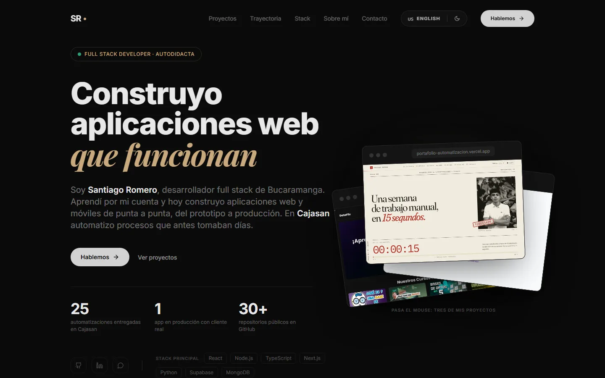
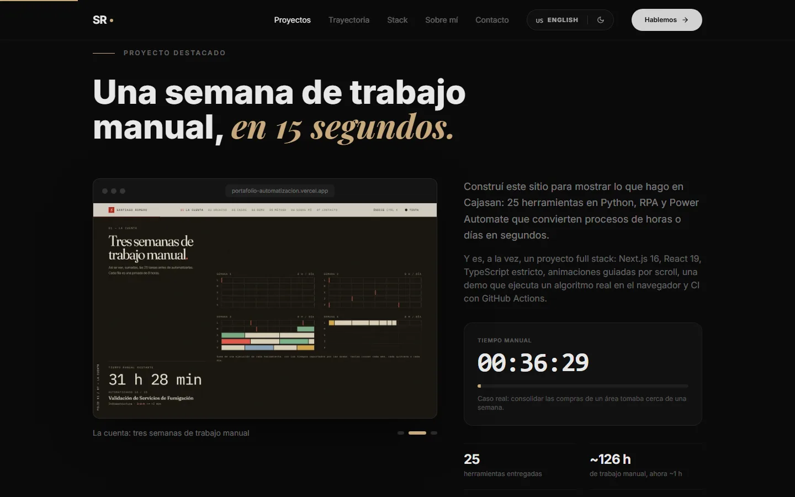
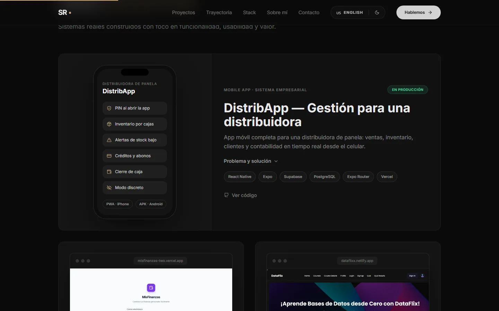

<div align="center">



# Santiago Romero — Full Stack Developer

**Desarrollador full stack autodidacta en Bucaramanga, Colombia.**<br />
Construyo aplicaciones web y móviles de punta a punta y, en Cajasan, automatizo procesos que antes tomaban días.

[](https://srmdev.vercel.app/)


</div>

---

## 🧭 Recorrido

| Sección | Qué muestra |
| --- | --- |
| **Portada** | Quién soy en una frase, cifras verificables y un mazo con capturas reales de mis proyectos que se abre al pasar el mouse. |
| **Proyecto destacado** | [Automatizaciones](https://portafolio-automatizacion.vercel.app): el sitio que construí para mostrar las 25 herramientas que entregué en Cajasan. Capturas en rotación y un reloj que pasa de `40:00:00` a `00:00:15` con el scroll. |
| **Proyectos** | Casos de estudio con su visual: celular para DistribApp, capturas reales y terminales para los proyectos de consola. Los proyectos en equipo están señalados como tales. |
| **Trayectoria** | Cajasan, trabajo freelance y formación autodidacta, en una línea de tiempo. |
| **Stack** | Cada tecnología dice en qué proyecto la usé, en lugar de un nivel autoevaluado. Incluye una bitácora de aprendizaje: qué ya está en proyectos, qué estoy aprendiendo y qué sigue. |
| **Sobre mí y contacto** | Mi historia, mis principios y cómo escribirme. |

<table>
  <tr>
    <td width="50%"></td>
    <td width="50%"></td>
  </tr>
</table>

## ✨ Características

- 🌎 **Bilingüe (ES / EN)** con `react-i18next`; el idioma elegido se recuerda.
- 🌙 **Modo oscuro y claro**; el tema elegido se recuerda y se aplica antes de pintar, sin destellos.
- 🎞️ **Animaciones con propósito** con Framer Motion: el mazo de la portada, el reloj guiado por scroll y el halo que sigue al cursor en las tarjetas.
- 🔗 **Vista previa al compartir** (Open Graph) con imagen propia.
- 📱 **Responsive** de principio a fin.

## 🛠️ Stack

- **Frontend:** React 18 + Vite
- **Estilos:** Tailwind CSS
- **Animaciones:** Framer Motion
- **Internacionalización:** react-i18next
- **Calidad:** ESLint
- **Despliegue:** Vercel

## 🗂️ Estructura

```plaintext
Portafolio/
├── public/
│   ├── img/            # Foto de perfil
│   ├── projects/       # Capturas reales de los proyectos
│   └── og.png          # Imagen para compartir el enlace
├── src/
│   ├── components/     # Secciones (Hero, Featured, Projects, Experience, Skills…) y Visuals
│   ├── data/           # Proyectos y enlaces
│   ├── hooks/          # Halo que sigue al cursor
│   ├── locales/        # Textos en español e inglés
│   ├── i18n.js
│   ├── App.jsx
│   └── main.jsx
├── legacy/             # Primera versión en HTML, CSS y JS vanilla
├── index.html
└── vercel.json
```

## ⚙️ Correrlo localmente

```bash
git clone https://github.com/SantiagoRomero7/Portafolio.git
cd Portafolio
npm install
npm run dev
```

| Script | Qué hace |
| --- | --- |
| `npm run dev` | Servidor de desarrollo |
| `npm run build` | Build de producción en `dist/` |
| `npm run preview` | Sirve el build de producción |
| `npm run lint` | ESLint |

Para agregar un proyecto: sus datos van en [`src/data/projects.js`](src/data/projects.js) y sus textos en [`src/locales/es.json`](src/locales/es.json) y [`src/locales/en.json`](src/locales/en.json).

## 📬 Contacto

- 📧 **santirmrm420@gmail.com**
- 💼 [LinkedIn](https://www.linkedin.com/in/santiago-romero-9a673a37a/)
- 💻 [GitHub](https://github.com/SantiagoRomero7)

---

> "Del HTML al React — siempre construyendo, siempre aprendiendo." 🚀
